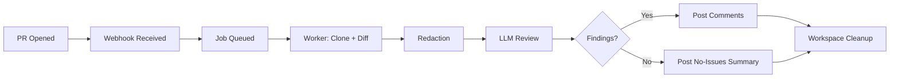
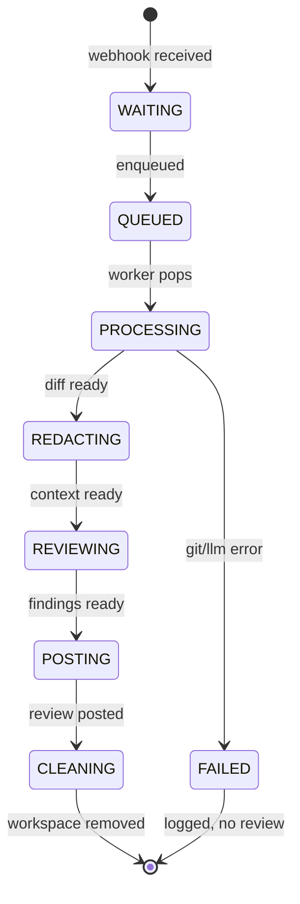

# AppFlow — AegisAI: Application Flow

| Field | Value |
| --- | --- |
| Version | v0.1 |
| Last Updated | 2026-08-06 |
| Owner | Product Manager / QA |
| Status | In Review |

---

## 1. Screen Inventory

AegisAI's "screens" are external surfaces: the GitHub PR UI and operator-facing logs. No internal UI in v1.

| SCR-### | Screen | Purpose | Entry Points | Exit Points | Auth |
| --- | --- | --- | --- | --- | --- |
| SCR-001 | GitHub PR (author view) | Author sees review comments | PR opened/pushed | PR updated | GitHub |
| SCR-002 | GitHub PR (review summary) | "No issues found" or findings | Review posted | — | GitHub |
| SCR-003 | Worker logs / metrics | Operator debugging | stdout, Prometheus | — | operator |

## 2. Navigation Map

## 3. Detailed Flow per Journey

## 4. Empty / Loading / Error States

| Surface | Empty | Loading | Error |
| --- | --- | --- | --- |
| PR review | "No issues found" | GitHub "pending" state | Review absent + operator logs show FAILED |
| Queue | 0 jobs | jobs pending | Redis unreachable → API logs error |
| LLM call | — | spinner in worker | Provider error → job marked failed |

## 5. Edge Cases & Branching Logic

| IF condition | THEN route |
| --- | --- |
| Webhook signature invalid | Reject 400, no job |
| PR already reviewed for same head_sha | Skip duplicate (idempotency) |
| Private repo without access | Job fails at clone, logged |
| Large diff | Truncate/segment before LLM (configurable) |
| Clean PR | Post "no issues found" summary |

## 6. Notifications & Re-engagement

| Trigger | Channel | Destination |
| --- | --- | --- |
| Review posted | GitHub inline comments | PR thread |
| Review failed | Logs + (future) Slack hook | operators |
| No findings | GitHub summary comment | PR thread |

## 7. Cross-Platform Deltas

N/A — backend-only service; no mobile/desktop clients.

## 8. Related Documents

| Document | Relationship |
| --- | --- |
| [PRD.md](../product/PRD.md) | Journeys derive from user stories |
| [TechSpec.md](../technical/TechSpec.md) | Components behind each state |
| [Design.md](Design.md) | Comment formatting rules |
| [Schema.md](../technical/Schema.md) | Persisted review/finding records |
| [ImplementationPlan.md](../project/ImplementationPlan.md) | Tasks by flow stage |
| [Tracker.md](../project/Tracker.md) | Status |
| [Rules.md](../project/Rules.md) | Standards |
| [API.md](../technical/API.md) | Webhook contract |
| [SecurityAndCompliance.md](../technical/SecurityAndCompliance.md) | Signature verification |
| [Testing.md](../technical/Testing.md) | Flow test cases |
| [Deployment.md](../technical/Deployment.md) | Environments |
| [Glossary.md](../reference/Glossary.md) | Vocabulary |
| [RiskRegister.md](../project/RiskRegister.md) | Risks |
