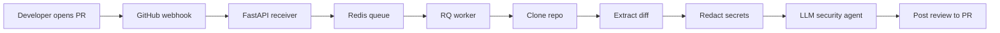

# PRD — AegisAI: AI-Powered Security Code Review for GitHub Pull Requests

| Field | Value |
| --- | --- |
| Version | v0.1 |
| Last Updated | 2026-08-06 |
| Owner | Product Manager |
| Status | In Review |

---

## 1. Executive Summary

AegisAI is an automated, security-focused code review agent that listens to GitHub pull-request events via webhook, analyzes the diff in full repository context, and posts a severity-ranked security review directly on the PR. It is built as a FastAPI receiver + Redis-backed RQ worker pipeline that clones the repo, extracts the diff, redacts secrets, and runs an LLM security agent before posting results back to GitHub. The goal is to catch vulnerabilities (e.g., SQL injection via f-string) before they merge, without adding review latency to human workflows.

## 2. Problem Statement

- **User pain:** Security review is a bottleneck. Human reviewers miss vulnerabilities under time pressure, and most teams have no automated security gate on every PR.
- **Evidence/context:** A single un-reviewed PR can ship an injection vulnerability. Manual security review does not scale across many repos and many daily PRs.
- **Cost of not solving it:** Vulnerabilities land in production, incident response time, and costly rework.

## 3. Goals & Non-Goals

| Goal | Metric | Target |
| --- | --- | --- |
| Detect security issues on every opened/synchronized PR | % of PRs with a posted review | ≥ 90% within 60s of webhook receipt |
| Catch high-severity vulnerability classes (injection, secrets, auth bypass) | Recall on planted-vuln test set | ≥ 80% |
| Low review latency | Time from webhook → review posted | p95 < 60s |
| Never leak secrets | Secrets redacted before LLM context | 100% |
| Zero-noise on clean PRs | Clean PRs receiving "no issues" summary | 100% |

### Non-Goals (v1)
- Non-security code review (style, architecture) — v1 is security-only.
- Comment resolution / conversation management with the LLM.
- Support for GitLab / Bitbucket webhooks.
- Multi-tenant SaaS hosting (self-hosted single-tenant in v1).

## 4. Target Users & Personas

| Persona | Role | Goals | Frustrations | Quote | Tech Comfort |
| --- | --- | --- | --- | --- | --- |
| Priya — DevSecOps Engineer | Owns security gates for 10+ repos | Catch vulns pre-merge, prove coverage | Manual review doesn't scale | "I can't review every PR." | High |
| Arjun — Backend Developer | Ships Python/Node features daily | Fast, non-blocking feedback | Noise from bots, slow checks | "Tell me if my code is insecure, in context." | High |
| Riya — Engineering Manager | Owes security posture for the org | Metrics on security coverage | No visibility into what's reviewed | "Show me we're not shipping known vulns." | Medium |

## 5. User Stories

| ID | As a... | I want... | So that... | Priority | Acceptance Criteria |
| --- | --- | --- | --- | --- | --- |
| US-001 | DevSecOps engineer | PR webhooks to trigger automatic security review | Vulnerabilities are caught before merge | P0 | Webhook posts a review ≤ 60s after push |
| US-002 | Backend developer | Inline, line-anchored comments on the diff | I know exactly what to fix | P0 | Comments reference file/line |
| US-003 | Backend developer | A clean summary on safe PRs | I trust the bot isn't noisy | P1 | "No issues found" summary posted |
| US-004 | Engineering manager | A record of reviewed PRs and findings | Prove security coverage | P1 | Findings persisted (DB/file), queryable |
| US-005 | DevSecOps engineer | Secrets redacted before any LLM call | No secret leakage to third parties | P0 | Secret patterns masked in LLM context |
| US-006 | Developer | Workspaces cleaned up after each job | No disk accumulation on the worker | P1 | Workspace dir removed after review |

## 6. Feature List

| ID | Epic | Feature | Description | Priority | Status |
| --- | --- | --- | --- | --- | --- |
| REQ-001 | Webhook Ingestion | GitHub webhook receiver | Validates signature, routes `pull_request` events | P0 | Done |
| REQ-002 | Queueing | Redis RQ job queue | Decouples webhook from processing | P0 | Done |
| REQ-003 | Worker | RQ worker process | Consumes jobs, orchestrates pipeline | P0 | Done |
| REQ-004 | Diff Extraction | Clone + diff | Clones repo at PR head, extracts diff | P0 | Done |
| REQ-005 | Redaction | Secrets redaction | Masks credentials before LLM context | P0 | Done |
| REQ-006 | Review | LLM security agent | Analyzes diff in context, returns findings | P0 | Done |
| REQ-007 | Delivery | Post review | Posts inline review via GitHub API | P0 | Done |
| REQ-008 | Cleanup | Workspace cleanup | Removes cloned workspace post-job | P1 | Done |

## 7. User Journeys (high level)

## 8. Success Metrics / KPIs

| Metric | Target | Measurement |
| --- | --- | --- |
| North Star: vulns caught pre-merge | ≥ 80% recall on planted set | Manual test checklist (SQLi via f-string, clean PR) |
| Review latency | p95 < 60s | Worker logs, timestamps |
| Noise rate | 0 findings on clean PRs | Test checklist item |
| Coverage | ≥ 90% PRs reviewed | Webhook → review correlation |

## 9. Assumptions & Dependencies

- GitHub App with webhook + PR read/write permissions is provisioned.
- Redis is available (local Docker or hosted).
- An LLM provider API key is configured.
- Webhook reachability from GitHub (ngrok/smee for local dev).

## 10. Risks

Top 3 (full list in ../project/RiskRegister.md):
1. **LLM false positives/negatives** — mitigated by focused security-only prompt and manual test checklist.
2. **Secret leakage to LLM provider** — mitigated by mandatory redaction stage (REQ-005).
3. **Webhook latency / GitHub timeouts** — mitigated by async queue (returns fast, processes later).

## 11. Release Criteria

- [ ] Full manual test checklist passes: vulnerable PR → review within 30–60s; clean PR → "no issues found".
- [ ] Workspace folder verified cleaned up after job completion.
- [ ] Secrets confirmed redacted in LLM context.
- [ ] Setup documented (README): Redis, FastAPI, worker, ngrok/smee.
- [ ] CI passes on main.

## 12. Open Questions

| Question | Owner | Resolve by |
| --- | --- | --- |
| Should findings be persisted to a DB for metrics (v1 or v2)? | PM | Release 1.1 |
| Which LLM provider(s) in production? | Eng Lead | Release 1.0 |

## 13. Related Documents

| Document | Relationship |
| --- | --- |
| [TechSpec.md](../technical/TechSpec.md) | Architecture, components, data flow for this PRD |
| [AppFlow.md](../design/AppFlow.md) | Detailed webhook→review journey and states |
| [Design.md](../design/Design.md) | UI/UX (GitHub review output style) |
| [Schema.md](../technical/Schema.md) | Data model for persisted findings (if any) |
| [ImplementationPlan.md](../project/ImplementationPlan.md) | Phased build plan mapping to REQs |
| [Tracker.md](../project/Tracker.md) | Live status of REQ-001…008 |
| [Rules.md](../project/Rules.md) | Coding standards for AegisAI itself |
| [API.md](../technical/API.md) | Webhook endpoint contract |
| [SecurityAndCompliance.md](../technical/SecurityAndCompliance.md) | Secrets handling, webhook auth |
| [Testing.md](../technical/Testing.md) | Test checklist, unit/integration strategy |
| [Deployment.md](../technical/Deployment.md) | Process topology, env, rollout |
| [Glossary.md](../reference/Glossary.md) | Shared vocabulary (webhook, diff, redaction) |
| [RiskRegister.md](../project/RiskRegister.md) | Full risk register |
