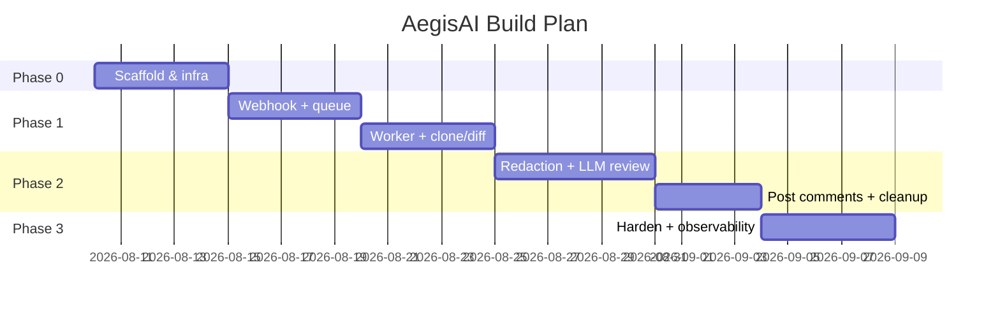
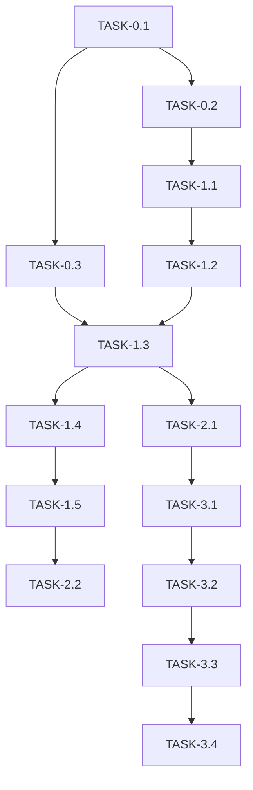

# ImplementationPlan — AegisAI: Phased Build Plan

| Field | Value |
| --- | --- |
| Version | v0.1 |
| Last Updated | 2026-08-06 |
| Owner | Engineering Lead |
| Status | In Review |

---

## 1. Build Philosophy

Walking skeleton first: get the webhook→queue→worker→LLM→review loop working end-to-end with a toy repo, then harden each stage (redaction, error handling, idempotency, observability). Ship vertically, never horizontally.

## 2. Phase Overview

## 3. Phase Breakdown

### Phase 0: Foundation
- Goal: project scaffold, CI, local Redis.
- Entry: repo exists, Python 3.10+ available.
- Exit: `uvicorn app.main:app --reload` boots; CI green.

| TASK-# | Description | Depends on | Owner | Est. | Maps to |
| --- | --- | --- | --- | --- | --- |
| TASK-0.1 | Scaffold FastAPI app + config | — | Eng | 2d | REQ-001 |
| TASK-0.2 | Docker + CI workflow | TASK-0.1 | Eng | 2d | — |
| TASK-0.3 | Redis + RQ setup | TASK-0.1 | Eng | 1d | REQ-002 |

### Phase 1: Core MVP Loop
- Goal: end-to-end review on a fixture repo.
- Entry: Phase 0 exit.
- Exit: manual test checklist passes on vulnerable + clean PRs.

| TASK-# | Description | Depends on | Owner | Est. | Maps to |
| --- | --- | --- | --- | --- | --- |
| TASK-1.1 | Webhook receiver + signature check | TASK-0.2 | Eng | 3d | REQ-001 |
| TASK-1.2 | Enqueue review job | TASK-1.1 | Eng | 1d | REQ-002 |
| TASK-1.3 | Worker: clone + diff extraction | TASK-0.3 | Eng | 3d | REQ-003, REQ-004 |
| TASK-1.4 | LLM security agent call | TASK-1.3 | Eng | 3d | REQ-006 |
| TASK-1.5 | Post review via GitHub API | TASK-1.4 | Eng | 2d | REQ-007 |

### Phase 2: Security & Cleanup
- Goal: no secrets to LLM; no disk leak.
- Entry: Phase 1 exit.
- Exit: redaction unit tests + cleanup verified.

| TASK-# | Description | Depends on | Owner | Est. | Maps to |
| --- | --- | --- | --- | --- | --- |
| TASK-2.1 | Secrets redaction module | TASK-1.3 | Eng | 3d | REQ-005 |
| TASK-2.2 | Workspace cleanup + tests | TASK-1.5 | Eng | 1d | REQ-008 |

### Phase 3: Harden & Observe
- Goal: production-ready reliability.
- Entry: Phase 2 exit.
- Exit: metrics dashboard live; retry/backoff in place.

| TASK-# | Description | Depends on | Owner | Est. | Maps to |
| --- | --- | --- | --- | --- | --- |
| TASK-3.1 | Idempotency by (repo, pr, head_sha) | TASK-2.1 | Eng | 2d | REQ-001 |
| TASK-3.2 | Retry/backoff on GitHub/LLM errors | TASK-3.1 | Eng | 2d | — |
| TASK-3.3 | Structured logs + Prometheus metrics | TASK-3.2 | Eng | 2d | — |
| TASK-3.4 | End-to-end test suite | TASK-3.3 | QA | 3d | US-001…006 |

## 4. Dependency Graph

## 5. Environment & Tooling Setup Checklist

- [ ] Python 3.10+ venv created
- [ ] `pip install -r requirements.txt`
- [ ] `.env` created from `.env.example`
- [ ] Redis running (Docker: `docker run -d -p 6379:6379 redis`)
- [ ] ngrok or smee tunnel for local webhook
- [ ] GitHub App created with PR read/write + webhook
- [ ] LLM API key configured

## 6. Rollout Strategy

- Feature flag `AEGIS_ENABLED` per repo (start with 1 pilot repo).
- Canary: enable on low-traffic repos, then roll out.
- Rollback: disable flag / stop worker → reviews stop cleanly (no data corruption).

## 7. Definition of Done (global)

- [ ] Tests written and passing for the task's unit/integration scope
- [ ] Docs updated (this suite) if behavior/API/schema changed
- [ ] Reviewed (human or bot)
- [ ] Secrets scanned (gitleaks) and none committed
- [ ] Logs verified (no sensitive data)

## 8. Related Documents

| Document | Relationship |
| --- | --- |
| [PRD.md](../product/PRD.md) | REQ/US mapping |
| [TechSpec.md](../technical/TechSpec.md) | Component responsibilities |
| [AppFlow.md](../design/AppFlow.md) | Flow stages |
| [Schema.md](../technical/Schema.md) | Data model tasks |
| [Design.md](../design/Design.md) | Output format |
| [Tracker.md](Tracker.md) | Live status of TASK-* |
| [Rules.md](Rules.md) | Engineering standards |
| [API.md](../technical/API.md) | Contract tasks |
| [SecurityAndCompliance.md](../technical/SecurityAndCompliance.md) | Security tasks |
| [Testing.md](../technical/Testing.md) | Test plan |
| [Deployment.md](../technical/Deployment.md) | Rollout context |
| [Glossary.md](../reference/Glossary.md) | Vocabulary |
| [RiskRegister.md](RiskRegister.md) | Risks |
