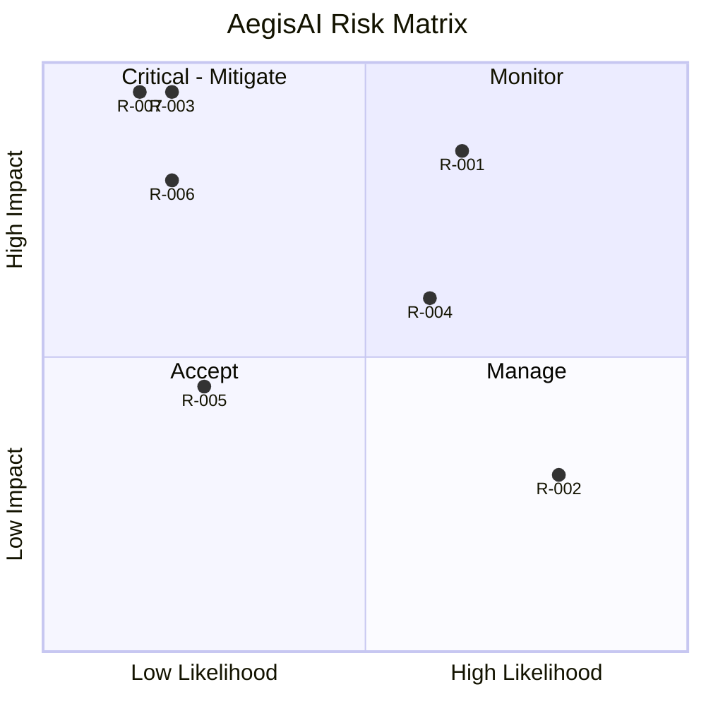

# RiskRegister — AegisAI: Known Risks

| Field | Value |
| --- | --- |
| Version | v0.1 |
| Last Updated | 2026-08-06 |
| Owner | PM / Engineering Lead |
| Status | In Review |

---

| Risk | Likelihood | Impact | Score (L×I) | Mitigation | Owner | Status |
| --- | --- | --- | --- | --- | --- | --- |
| R-001 LLM misses a real vuln | Medium | High | 9 | Focused security-only prompt; planted-vuln test set; semgrep companion (future) | Eng Lead | Open |
| R-002 LLM false positives annoy devs | High | Low | 4 | Severity honesty; "no issues" for clean PRs; feedback loop (future) | PM | Open |
| R-003 Secret leakage to LLM provider | Low | Critical | 8 | Mandatory redaction + tests (TC-001); provider DPA review | Security | Mitigating |
| R-004 GitHub rate limit exhaustion | Medium | Medium | 6 | Retry/backoff, token rotation, queue depth alerts | DevOps | Open |
| R-005 Webhook delivery loss | Low | Medium | 3 | GitHub re-delivery; manual re-trigger documented | DevOps | Accepted |
| R-006 Disk exhaustion on worker | Low | High | 6 | Workspace cleanup (REQ-008) + disk alerts | DevOps | Mitigating |
| R-007 Malicious repo code executes on worker | Low | Critical | 8 | Sandboxed clone dir; never execute cloned code | Security | Mitigating |

## Risk Matrix

## Related Documents

| Document | Relationship |
| --- | --- |
| [PRD.md](../product/PRD.md) | Top-3 risks summarized |
| [SecurityAndCompliance.md](../technical/SecurityAndCompliance.md) | R-003/R-007 detail |
| [TechSpec.md](../technical/TechSpec.md) | Technical risks |
| [AppFlow.md](../design/AppFlow.md) | Flow context |
| [Design.md](../design/Design.md) | Output format |
| [Schema.md](../technical/Schema.md) | Data model |
| [ImplementationPlan.md](ImplementationPlan.md) | Mitigation tasks |
| [Tracker.md](Tracker.md) | Risk status |
| [Rules.md](Rules.md) | Standards |
| [API.md](../technical/API.md) | Contract |
| [Testing.md](../technical/Testing.md) | Test coverage of mitigations |
| [Deployment.md](../technical/Deployment.md) | Rollback for R-005 |
| [Glossary.md](../reference/Glossary.md) | Vocabulary |
