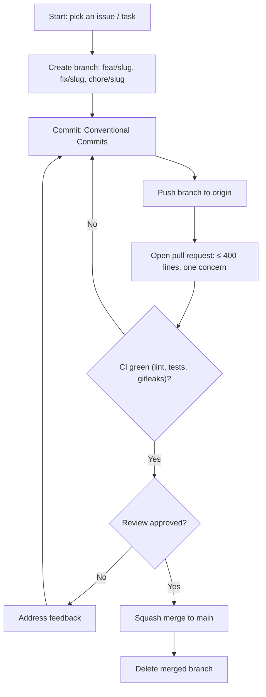

# Rules — AegisAI: Coding Standards & AI-Agent Operating Rules

| Field | Value |
| --- | --- |
| Version | v0.1 |
| Last Updated | 2026-08-06 |
| Owner | Engineering Lead |
| Status | In Review |

---

## 1. Guiding Principles

1. Readability over cleverness — the pipeline must be easy to audit.
2. No silent failures — every error is logged with context.
3. Security is the product — never weaken the redaction layer for convenience.
4. Small PRs only — each PR touches one stage.
5. Tests accompany every behavior change.
6. Deterministic before probabilistic — do redaction, routing, cleanup deterministically; reserve LLM for analysis only.

## 2. Code Style

- Python 3.10+, type hints required.
- Formatter: black; linter: ruff; isort for imports.
- Naming: `snake_case` functions/vars, `CamelCase` classes.
- Folder structure:

```
app/
  main.py            # FastAPI app
  config.py          # settings from env
  webhook.py         # signature verification + routing
  queue.py           # RQ enqueue helpers
  worker.py          # RQ worker entry
  pipeline/
    clone.py         # clone + diff
    redact.py        # secrets redaction
    review.py        # LLM security agent
    post.py          # GitHub review posting
  models.py          # Pydantic schemas
```

## 3. Git Workflow

- Branch naming: `feat/<slug>`, `fix/<slug>`, `chore/<slug>`.
- Commits: Conventional Commits (`feat:`, `fix:`, `chore:`).
- PR size: ≤ 400 lines, one concern.
- Reviewers: 1 required; CI must pass (lint, tests, gitleaks).
- Merge: squash merge to `main`.

## 4. Testing Requirements

- Minimum coverage: 70% overall, 90% on `pipeline/redact.py` (security-critical).
- MUST have tests: redaction, signature verification, idempotency, cleanup, LLM response parsing.
- Optional: pure formatting helpers.
- See [Testing.md](../technical/Testing.md).

## 5. AI Agent Operating Rules

- Always read Tracker.md and ImplementationPlan.md before starting a task.
- Never mark a task 🟢 Done in Tracker.md without tests passing.
- Never invent requirements not in ../product/PRD.md/../technical/TechSpec.md — flag ambiguity instead of guessing.
- Always update ../technical/Schema.md if a migration changes the data model.
- Never commit secrets/keys; use env vars per ../technical/SecurityAndCompliance.md.
- Always keep the redaction stage between any diff and the LLM — this is non-negotiable.
- When a rule conflicts with a request, state the conflict rather than silently picking one.

## 6. Security Baseline Rules

- Input validation on all webhook payloads (Pydantic).
- No raw git command string concatenation with untrusted input — use arg lists.
- Secrets management: env vars only; gitleaks in CI.
- Dependency scanning cadence: weekly (Dependabot).
- Webhook HMAC verified with constant-time comparison.

## 7. Documentation Rules

- Any change to the webhook contract updates ../technical/API.md in the same PR.
- Any change to persistence updates ../technical/Schema.md in the same PR.
- New env vars must be documented in ../technical/Deployment.md.

## 8. Prohibited Patterns

| Anti-pattern | Why |
| --- | --- |
| `except Exception: pass` | Hides pipeline failures |
| Logging raw diffs before redaction | Leaks secrets to logs |
| Posting LLM output without schema validation | Malformed comments on PRs |
| Hardcoded secrets | Trivial exfiltration |
| Writing to repo workspace outside managed dir | Disk/security issues |

## 9. Escalation Rules

**Ask a human when:** webhook signature keys rotate, LLM provider changes, new secret pattern types needed, or PRD-level scope changes.
**Decide autonomously:** stage refactors, test additions, log formatting, retry tuning.

## Git / PR Workflow



## 10. Related Documents

| Document | Relationship |
| --- | --- |
| [Testing.md](../technical/Testing.md) | Test requirements detailed |
| [SecurityAndCompliance.md](../technical/SecurityAndCompliance.md) | Security baseline expanded |
| [PRD.md](../product/PRD.md) | Requirements to never invent beyond |
| [TechSpec.md](../technical/TechSpec.md) | Architecture constraints |
| [AppFlow.md](../design/AppFlow.md) | Flow stages |
| [Design.md](../design/Design.md) | Output format |
| [Schema.md](../technical/Schema.md) | Data model |
| [ImplementationPlan.md](ImplementationPlan.md) | Tasks |
| [Tracker.md](Tracker.md) | Status |
| [API.md](../technical/API.md) | Contract |
| [Deployment.md](../technical/Deployment.md) | Env vars |
| [Glossary.md](../reference/Glossary.md) | Vocabulary |
| [RiskRegister.md](RiskRegister.md) | Risks |
