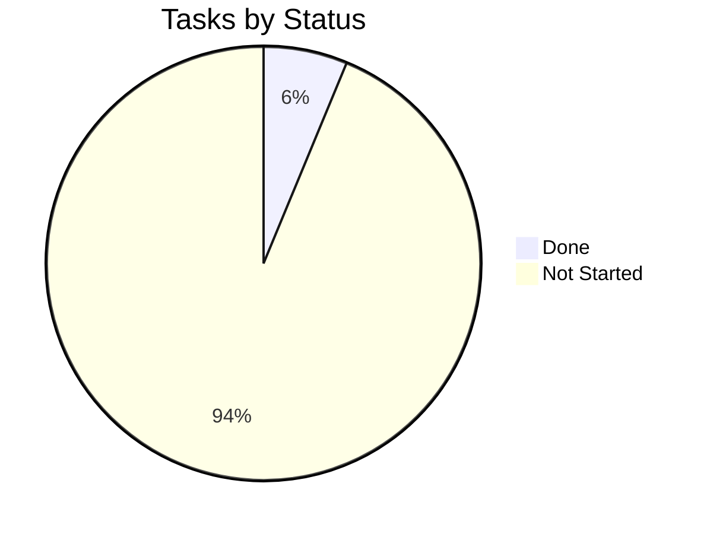

# Tracker — AegisAI: Living Status Tracker

| Field | Value |
| --- | --- |
| Version | v0.1 |
| Last Updated | 2026-08-06 |
| Owner | Engineering Lead |
| Status | In Review |

---

## 1. Snapshot Dashboard

| Metric | Value |
| --- | --- |
| Overall % Complete | 5% |
| Current Phase | Phase 0 |
| Tasks Done / Total | 1 / 16 |
| Blockers (open) | 0 |
| Days to Target Launch | 45 |

## 2. Status Legend

🟢 Done | 🟡 In Progress | 🔴 Blocked | ⚪ Not Started | 🔵 In Review

## 3. Phase Progress Bars

| Phase | Progress |
| --- | --- |
| Phase 0: Foundation | `[██░░░░░░░░] 33%` |
| Phase 1: Core MVP | `[░░░░░░░░░░] 0%` |
| Phase 2: Security & Cleanup | `[░░░░░░░░░░] 0%` |
| Phase 3: Harden & Observe | `[░░░░░░░░░░] 0%` |

## 4. Full Task Table

| TASK | Description | Status | Assignee | Start | Target | Actual | Notes |
| --- | --- | --- | --- | --- | --- | --- | --- |
| TASK-0.1 | Scaffold FastAPI app + config | 🟢 | Eng | 2026-08-10 | 2026-08-12 | — | code exists in repo |
| TASK-0.2 | Docker + CI workflow | ⚪ | Eng | — | — | — |  |
| TASK-0.3 | Redis + RQ setup | ⚪ | Eng | — | — | — |  |
| TASK-1.1 | Webhook receiver + signature check | ⚪ | Eng | — | — | — |  |
| TASK-1.2 | Enqueue review job | ⚪ | Eng | — | — | — |  |
| TASK-1.3 | Worker: clone + diff extraction | ⚪ | Eng | — | — | — |  |
| TASK-1.4 | LLM security agent call | ⚪ | Eng | — | — | — |  |
| TASK-1.5 | Post review via GitHub API | ⚪ | Eng | — | — | — |  |
| TASK-2.1 | Secrets redaction module | ⚪ | Eng | — | — | — |  |
| TASK-2.2 | Workspace cleanup + tests | ⚪ | Eng | — | — | — |  |
| TASK-3.1 | Idempotency | ⚪ | Eng | — | — | — |  |
| TASK-3.2 | Retry/backoff | ⚪ | Eng | — | — | — |  |
| TASK-3.3 | Logs + metrics | ⚪ | Eng | — | — | — |  |
| TASK-3.4 | E2E test suite | ⚪ | QA | — | — | — |  |

## 5. Blockers Log

| ID | Description | Raised | Owner | Impact | Status |
| --- | --- | --- | --- | --- | --- |
| BLK-001 | None open | — | — | — | — |

## 6. Changelog

- 2026-08-06: **Documentation suite complete** — 14-file suite consolidated into `docs/`, categorized structure, cross-linked navigation, deployment/git/auth diagrams, quality gate passed (238/238), merged to `main`.
| Date | What shipped |
| --- | --- |
| 2026-08-06 | Documentation suite v0.1 created |
| 2026-08-12 | FastAPI scaffold (TASK-0.1) |

## 7. Burndown Summary

## 8. Next 3 Priorities

1. TASK-0.2 — Docker + CI workflow.
2. TASK-0.3 — Redis + RQ setup.
3. TASK-1.1 — Webhook receiver + signature check.

## 9. Related Documents

| Document | Relationship |
| --- | --- |
| [ImplementationPlan.md](ImplementationPlan.md) | Task definitions mirrored here |
| [PRD.md](../product/PRD.md) | Feature status source |
| [TechSpec.md](../technical/TechSpec.md) | Component context |
| [AppFlow.md](../design/AppFlow.md) | Flow stages |
| [Design.md](../design/Design.md) | Output format |
| [Schema.md](../technical/Schema.md) | Data model |
| [Rules.md](Rules.md) | Standards |
| [API.md](../technical/API.md) | Contract |
| [SecurityAndCompliance.md](../technical/SecurityAndCompliance.md) | Security |
| [Testing.md](../technical/Testing.md) | Test plan |
| [Deployment.md](../technical/Deployment.md) | Rollout |
| [Glossary.md](../reference/Glossary.md) | Vocabulary |
| [RiskRegister.md](RiskRegister.md) | Risks |
