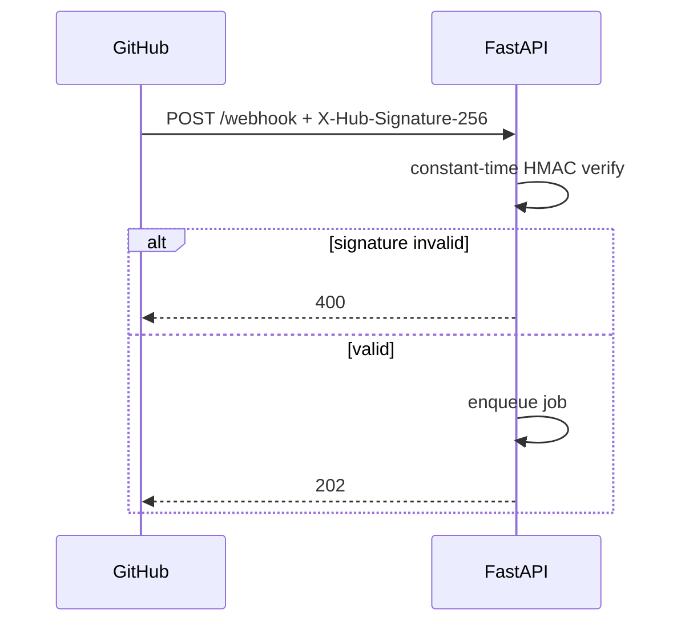

# API — AegisAI: API Reference

| Field | Value |
| --- | --- |
| Version | v0.1 |
| Last Updated | 2026-08-06 |
| Owner | Backend Engineer |
| Status | In Review |

---

## 1. Endpoint Inventory

| Method | Path | Auth | Description |
| --- | --- | --- | --- |
| POST | `/webhook` | HMAC signature | GitHub webhook receiver |
| GET | `/healthz` | none | Liveness probe |

## 2. Webhook: POST /webhook

- **Headers:** `X-Hub-Signature-256` (HMAC-SHA256 of body, webhook secret), `X-GitHub-Event: pull_request`.
- **Request (pull_request.opened):** GitHub PR payload — repo url, `number`, `pull_request.head.sha`.
- **Response:** `202 Accepted` (enqueued) | `400` (bad signature/payload).
- **Rate limits:** GitHub-side webhook delivery; app should handle bursts via queue.

### Example request (abridged)

```json
{
  "action": "opened",
  "number": 42,
  "repository": { "full_name": "acme/app", "clone_url": "https://github.com/acme/app.git" },
  "pull_request": { "head": { "sha": "a1b2c3d4" } }
}
```

### Example response

```
202 Accepted
```

## 3. Health: GET /healthz

- Response: `{"status": "ok"}` `200`.

## 4. Error Codes

| Code | Meaning | Retry? |
| --- | --- | --- |
| 400 | Bad signature or invalid payload | No (fix sender) |
| 202 | Accepted — job queued | No |
| 5xx | Internal error | Yes, with backoff |

## 5. Versioning Policy

- Webhook payload schema follows GitHub's versioned webhook payloads.
- App API is internal; `/healthz` is the only stable endpoint in v1.

## 6. Auth Flow



## 7. Related Documents

| Document | Relationship |
| --- | --- |
| [TechSpec.md](TechSpec.md) | Component hosting these endpoints |
| [SecurityAndCompliance.md](SecurityAndCompliance.md) | HMAC verification detail |
| [AppFlow.md](../design/AppFlow.md) | Flow after 202 |
| [Schema.md](Schema.md) | Job record created |
| [PRD.md](../product/PRD.md) | REQ-001 |
| [Design.md](../design/Design.md) | Output format |
| [ImplementationPlan.md](../project/ImplementationPlan.md) | Contract tasks |
| [Tracker.md](../project/Tracker.md) | Status |
| [Rules.md](../project/Rules.md) | Standards |
| [Testing.md](Testing.md) | Contract tests |
| [Deployment.md](Deployment.md) | Endpoint exposure |
| [Glossary.md](../reference/Glossary.md) | Vocabulary |
| [RiskRegister.md](../project/RiskRegister.md) | Risks |
