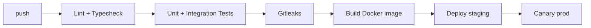

# Deployment — AegisAI: Environments, CI/CD, Rollback

| Field | Value |
| --- | --- |
| Version | v0.1 |
| Last Updated | 2026-08-06 |
| Owner | DevOps Engineer |
| Status | In Review |

---

## 1. Service Topology

| Service | Base | Purpose | Port |
| --- | --- | --- | --- |
| api | Python 3.10 + FastAPI | Webhook receiver | 8000 |
| worker | Python 3.10 + RQ | Job processing | — |
| redis | redis:7-alpine | Job queue | 6379 |

## 2. CI/CD Pipeline

## 3. Environment Promotion Flow

| Step | From | To | Trigger |
| --- | --- | --- | --- |
| 1 | main | staging | CI green |
| 2 | staging | prod canary | manual approval |
| 3 | canary | prod full | health metrics OK |

## 4. Rollback Procedure

1. Disable `AEGIS_ENABLED` flag for affected repos (immediate stop of new reviews).
2. Revert image tag to previous stable (`docker tag` + restart).
3. Verify no partial reviews posted (idempotency prevents duplicates).

## 5. Feature Flag Policy

- `AEGIS_ENABLED_REPOS`: comma-separated allow-list; default empty.
- Flags live in env/config, not code branches.

## 6. On-Call / Runbook Basics

- **Webhook failing:** check API logs for signature errors → verify GitHub App secret rotation.
- **Queue growing:** add workers; check for slow LLM provider.
- **Reviews not posting:** check GitHub API token scopes + rate limits.

## 7. Related Documents

| Document | Relationship |
| --- | --- |
| [TechSpec.md](TechSpec.md) | Environment matrix |
| [SecurityAndCompliance.md](SecurityAndCompliance.md) | Secret management |
| [PRD.md](../product/PRD.md) | Release criteria |
| [AppFlow.md](../design/AppFlow.md) | Flow context |
| [Schema.md](Schema.md) | Migrations in deploy |
| [Design.md](../design/Design.md) | Output format |
| [ImplementationPlan.md](../project/ImplementationPlan.md) | Rollout strategy |
| [Tracker.md](../project/Tracker.md) | Status |
| [Rules.md](../project/Rules.md) | Standards |
| [API.md](API.md) | Endpoints |
| [Testing.md](Testing.md) | CI gates |
| [Glossary.md](../reference/Glossary.md) | Vocabulary |
| [RiskRegister.md](../project/RiskRegister.md) | Risks |
