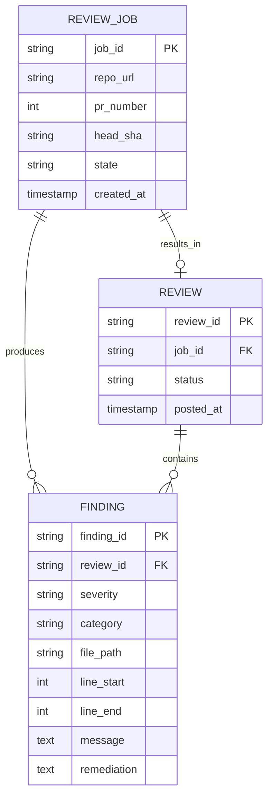

# Schema — AegisAI: Data Model & Database Design

| Field | Value |
| --- | --- |
| Version | v0.1 |
| Last Updated | 2026-08-06 |
| Owner | Backend Engineer |
| Status | In Review |

---

> v1 persistence is minimal (job state + optional findings log). If metrics/persistence is approved (Open Question in ../product/PRD.md), the tables below are the target model.

## 1. ER Diagram



## 2. Table/Collection Definitions

### TBL-review_job
| Field | Type | Nullable | Default | Constraints | Description |
| --- | --- | --- | --- | --- | --- |
| job_id | string PK | No | — | unique | RQ job id |
| repo_url | string | No | — | — | GitHub repo URL |
| pr_number | int | No | — | — | PR number |
| head_sha | string | No | — | — | PR head commit |
| state | enum | No | queued | queued/processing/done/failed | pipeline state |
| created_at | timestamp | No | now() | — | enqueue time |

### TBL-review
| Field | Type | Nullable | Default | Constraints | Description |
| --- | --- | --- | --- | --- | --- |
| review_id | string PK | No | — | unique | GitHub review id |
| job_id | string FK | No | — | → TBL-review_job | owning job |
| status | enum | No | pending | pending/posted/failed | post status |
| posted_at | timestamp | Yes | — | — | post time |

### TBL-finding
| Field | Type | Nullable | Default | Constraints | Description |
| --- | --- | --- | --- | --- | --- |
| finding_id | string PK | No | — | unique | finding id |
| review_id | string FK | No | — | → TBL-review | parent review |
| severity | enum | No | — | blocking/warning/nit | severity |
| category | enum | No | — | injection/secrets/auth/other | category |
| file_path | string | No | — | — | file |
| line_start | int | No | — | ≥1 | start line |
| line_end | int | No | line_start | ≥line_start | end line |
| message | text | No | — | — | description |
| remediation | text | Yes | — | — | suggested fix |

## 3. Relationships & Foreign Keys

| Table A | Table B | On delete | Justification |
| --- | --- | --- | --- |
| review | review_job | cascade | orphan reviews meaningless |
| finding | review | cascade | findings belong to a review |

## 4. Indexes

| Table | Index | Columns | Type | Reason |
| --- | --- | --- | --- | --- |
| review_job | idx_job_state | (state) | btree | queue status queries |
| review | idx_review_job | (job_id) | btree | FK lookup |
| finding | idx_finding_review | (review_id) | btree | FK lookup |

## 5. Enums / Constants

| Enum | Allowed values |
| --- | --- |
| job_state | queued, processing, done, failed |
| review_status | pending, posted, failed |
| severity | blocking, warning, nit |
| category | injection, secrets, auth, other |

## 6. Data Lifecycle

- Jobs older than 90 days purged by scheduled job (if persisted).
- Findings retained indefinitely for audit (if metrics approved).
- Soft-delete: N/A — hard delete on purge.

## 7. Migrations Strategy

- Tool: Alembic (if SQLAlchemy persistence adopted).
- Naming: `<rev>_<slug>.py`.
- Rollback: `alembic downgrade -1`.

## 8. Sample Records

```json
{
  "job_id": "job_7f3a",
  "repo_url": "https://github.com/acme/app",
  "pr_number": 42,
  "head_sha": "a1b2c3d4",
  "state": "done"
}
```

## 9. Data Validation Rules

| Field | DB constraint | App layer |
| --- | --- | --- |
| pr_number | > 0 | Pydantic model |
| line_start | ≥ 1 | Pydantic model |
| severity/category | enum | Pydantic Literal |

## 10. Sensitive Data Map

| Field | Sensitivity | Encrypted at rest? | Masked in logs? |
| --- | --- | --- | --- |
| repo_url | none | no | no |
| head_sha | none | no | partial (log redaction) |
| finding.message | none | no | no |
| raw diff (transient) | **secrets** | n/a (in-memory) | **redacted pre-LLM** |

## 11. Related Documents

| Document | Relationship |
| --- | --- |
| [API.md](API.md) | Endpoints that touch these tables |
| [TechSpec.md](TechSpec.md) | Persistence decision context |
| [PRD.md](../product/PRD.md) | Open question on persistence |
| [AppFlow.md](../design/AppFlow.md) | Flow states map to job_state |
| [Design.md](../design/Design.md) | Finding fields → comment format |
| [ImplementationPlan.md](../project/ImplementationPlan.md) | Schema tasks |
| [Tracker.md](../project/Tracker.md) | Status |
| [Rules.md](../project/Rules.md) | Standards |
| [SecurityAndCompliance.md](SecurityAndCompliance.md) | Secrets handling |
| [Testing.md](Testing.md) | Data tests |
| [Deployment.md](Deployment.md) | Migrations in deploy |
| [Glossary.md](../reference/Glossary.md) | Vocabulary |
| [RiskRegister.md](../project/RiskRegister.md) | Risks |
