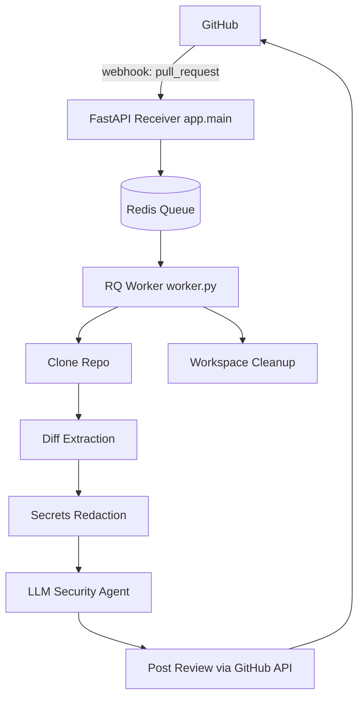
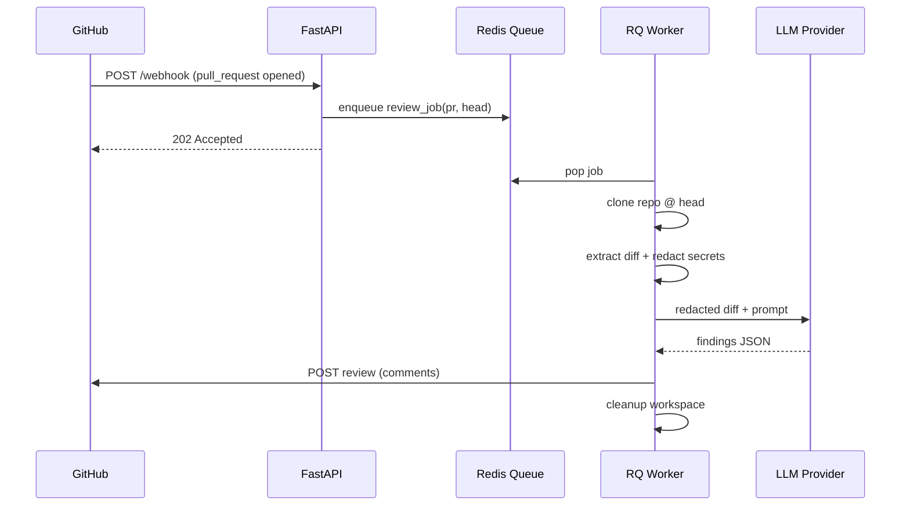
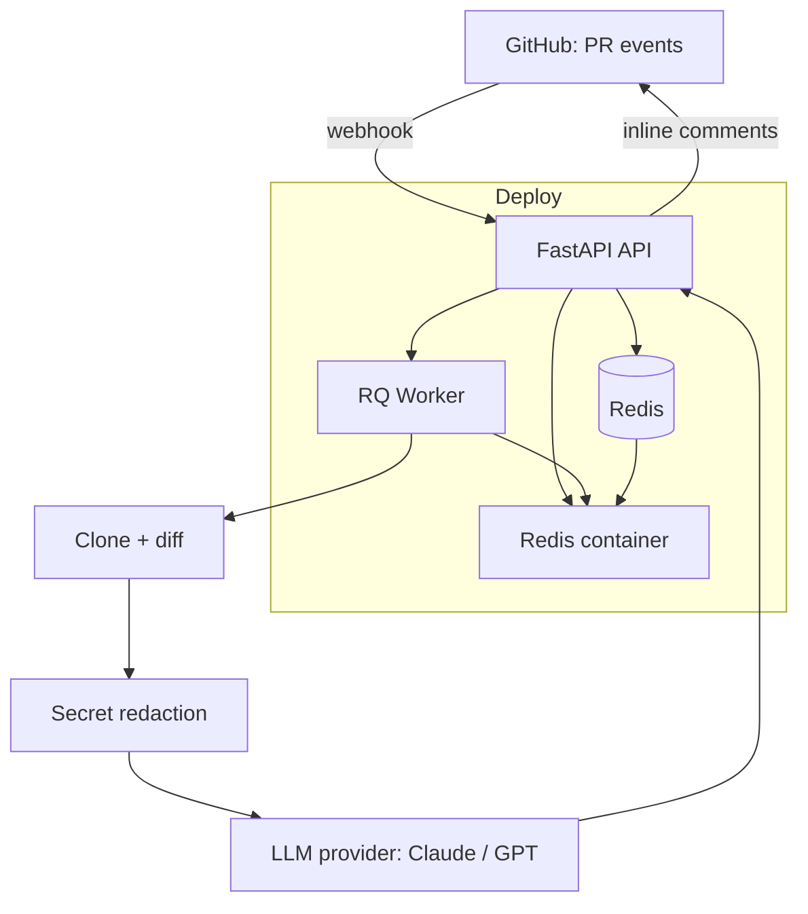
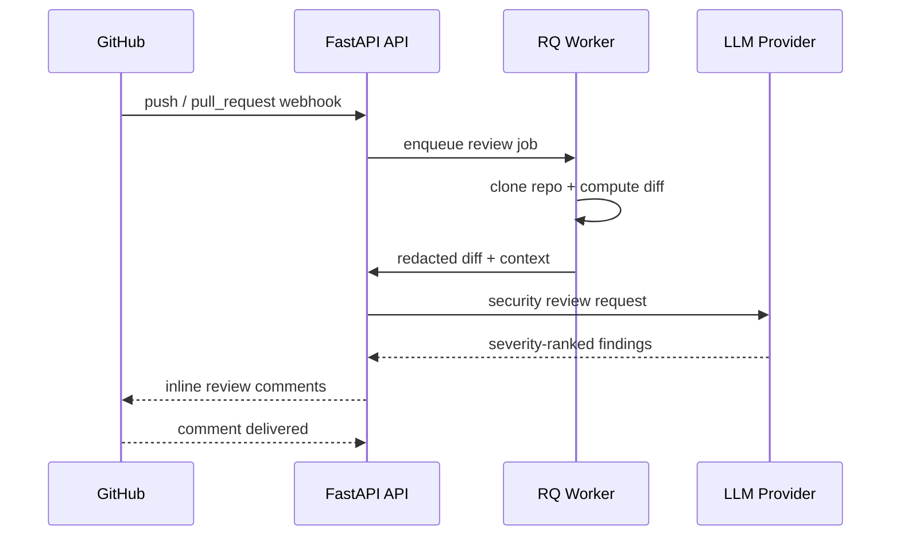

# TechSpec — AegisAI: Technical Specification

| Field | Value |
| --- | --- |
| Version | v0.1 |
| Last Updated | 2026-08-06 |
| Owner | Engineering Lead |
| Status | In Review |

---

## 1. Architecture Overview

## 2. Tech Stack Table

| Layer | Technology | Version | Justification |
| --- | --- | --- | --- |
| API server | FastAPI + Uvicorn | 0.100+ | Async, fast, auto OpenAPI docs |
| Queue | Redis + RQ | Redis 7 | Simple durable job queue, low ops overhead |
| Worker | RQ worker (Python) | — | Same language as API, no extra infra |
| Git operations | git CLI (subprocess) | system git | Clone/fetch/diff fidelity |
| LLM | Claude/GPT security agent | provider-dependent | Semantic security reasoning |
| Secrets detection | regex/heuristics + redaction | — | Deterministic pre-LLM masking |
| Language | Python | 3.10+ | Team stack, ecosystem |

## 3. System Components

| Component | Responsibility | Inputs → Outputs | Scaling | Failure Modes |
| --- | --- | --- | --- | --- |
| FastAPI receiver | Verify webhook, enqueue job, return fast | POST JSON → 200/202 | Horizontal (stateless) | Bad signature → 400 |
| Redis queue | Durable job buffer | Job → job record | Vertical; add replicas | Redis down → jobs lost (see Deployment.md) |
| RQ worker | Consume jobs, run pipeline | Job → result | Add workers for throughput | Crash mid-job → retry/lost; cleanup required |
| Clone/diff | Reproduce PR state | repo_url, head sha → diff | per-job | Large repos slow; timeout |
| Redaction | Mask secrets pre-LLM | diff → redacted diff | in-process | Over-redaction hides context |
| LLM agent | Security analysis | redacted diff + context → findings | provider rate limits | Provider outage → review fails |

## 4. Data Flow Diagrams

## 5. Third-Party Integrations

| Service | Purpose | Failure Fallback | Cost Model | Rate Limits |
| --- | --- | --- | --- | --- |
| GitHub API | Read PR, post review | Retry with backoff | Free (API quota) | ~5000 req/hr per token |
| GitHub webhooks | Event delivery | None (manual re-trigger) | Free | Event-driven |
| LLM provider | Security analysis | Fail review with clear error | Token-based | Provider-specific |

## 6. Non-Functional Requirements

| Category | Requirement | Target | How Verified |
| --- | --- | --- | --- |
| Performance | webhook→review latency | p95 < 60s | Worker timestamps |
| Availability | queue survives API restarts | Redis persists jobs | Docker restart test |
| Scalability | parallel PR reviews | 10+ concurrent jobs | Run N workers |
| Security | secrets never sent to LLM | 100% | Redaction unit tests |
| Observability | per-job logs with IDs | all jobs logged | Log inspection |

## 7. Environments

| Env | URL | Data Policy | Deploy Trigger | Access |
| --- | --- | --- | --- | --- |
| dev | localhost:8000 | local clone, seeded data | manual `uvicorn --reload` | developer |
| staging | staging URL | synthetic repo fixtures | CI on main merge | team |
| prod | prod URL | real repos | tagged release + rollout | admin |

## 8. Error Handling Strategy

- Webhook signature failure → `400` + log (no enqueue).
- Job failure → retry with exponential backoff (RQ), max 3 attempts.
- LLM provider outage → mark review `failed`, log full context, do not post partial review.
- Git failures (repo not found) → log, mark review failed.
- Idempotency: key job by `(repo, pr_number, head_sha)` to avoid duplicate reviews.

## 9. Observability

- Structured JSON logs with `job_id`, `repo`, `pr_number`, stage timings.
- Prometheus metrics: jobs enqueued, succeeded, failed, latency histograms.
- Dashboard: queue depth, worker count, error rate.

## 10. Technical Risks & Mitigations

| Risk | Mitigation |
| --- | --- |
| LLM hallucination / missed vulns | Focused security-only prompt + manual test checklist in CI |
| Secret leakage | Mandatory redaction stage + unit tests (see SecurityAndCompliance.md) |
| GitHub API rate limits | Retry/backoff, token rotation |
| Disk exhaustion on worker | Workspace cleanup after each job (REQ-008) |

## Deployment Topology

## Sequence: Pull-Request Review Pipeline

## 11. Related Documents

| Document | Relationship |
| --- | --- |
| [PRD.md](../product/PRD.md) | Requirements this spec implements |
| [Schema.md](Schema.md) | Data model for persisted findings |
| [API.md](API.md) | Webhook endpoint contract |
| [AppFlow.md](../design/AppFlow.md) | End-to-end flow with states |
| [Design.md](../design/Design.md) | Review output formatting |
| [ImplementationPlan.md](../project/ImplementationPlan.md) | Build phases |
| [Tracker.md](../project/Tracker.md) | Task status |
| [Rules.md](../project/Rules.md) | Engineering standards |
| [SecurityAndCompliance.md](SecurityAndCompliance.md) | Secrets, webhook auth |
| [Testing.md](Testing.md) | Test strategy |
| [Deployment.md](Deployment.md) | Topology, rollout |
| [Glossary.md](../reference/Glossary.md) | Vocabulary |
| [RiskRegister.md](../project/RiskRegister.md) | Risks |
