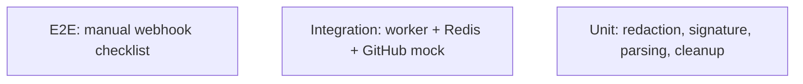

# Testing — AegisAI: Test Strategy

| Field | Value |
| --- | --- |
| Version | v0.1 |
| Last Updated | 2026-08-06 |
| Owner | QA Engineer |
| Status | In Review |

---

## 1. Test Pyramid

## 2. Strategy

| Layer | Tool | Scope |
| --- | --- | --- |
| Unit | pytest | Redaction rules, HMAC verify, Pydantic schemas, LLM output parsing |
| Integration | pytest + fakeredis + respx | Webhook→queue→worker→post with mocked GitHub/LLM |
| E2E | Manual checklist (README) | Real webhook via ngrok/smee, vulnerable + clean PRs |

## 3. Critical Test Cases

| ID | Feature | Case | Expected |
| --- | --- | --- | --- |
| TC-001 | Redaction | SQLi f-string diff passes through unchanged; secrets masked | Secret pattern not in LLM context |
| TC-002 | Signature | Valid HMAC accepted; tampered body rejected | 202 vs 400 |
| TC-003 | Pipeline | Vulnerable PR → review with injection finding | Review posted ≤ 60s |
| TC-004 | Clean PR | No issues → "no issues found" summary | Summary posted |
| TC-005 | Idempotency | Duplicate delivery of same head_sha | No duplicate review |
| TC-006 | Cleanup | Workspace removed after job | Dir gone |
| TC-007 | LLM failure | Provider returns malformed JSON | Corrective retry, then failed status |

## 4. Test Data Strategy

- Fixture repos with planted vulns (SQL injection, hardcoded secrets, auth bypass) and clean repos.
- Seeded via git fixtures; no real customer data.

## 5. CI Gates

- `pytest` must pass on every PR.
- `gitleaks` scan on CI (no secrets committed).
- Coverage gate ≥ 70% overall, ≥ 90% on redaction module.

## 6. Related Documents

| Document | Relationship |
| --- | --- |
| [Rules.md](../project/Rules.md) | Test requirements |
| [PRD.md](../product/PRD.md) | Release criteria checklist |
| [TechSpec.md](TechSpec.md) | Components under test |
| [AppFlow.md](../design/AppFlow.md) | Flow test cases |
| [Schema.md](Schema.md) | Data tests |
| [API.md](API.md) | Contract tests |
| [Design.md](../design/Design.md) | Format tests |
| [ImplementationPlan.md](../project/ImplementationPlan.md) | TASK-3.4 |
| [Tracker.md](../project/Tracker.md) | Status |
| [SecurityAndCompliance.md](SecurityAndCompliance.md) | Security tests |
| [Deployment.md](Deployment.md) | Test env |
| [Glossary.md](../reference/Glossary.md) | Vocabulary |
| [RiskRegister.md](../project/RiskRegister.md) | Risks |
